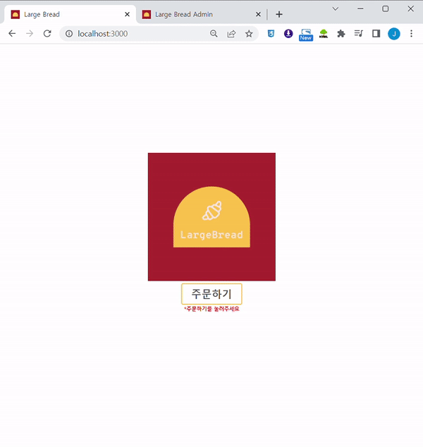
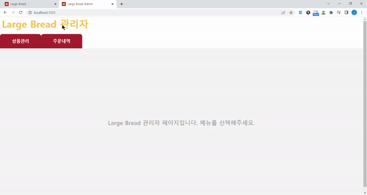

 

## 기술 스택
  

## 프로젝트
### [Client]
메가 커피에서 사용하는 Easy Kiosk를 바탕으로 제작하였습니다.

 

<a href="https://github.com/juaehan/LargeBread">키오스크페이지 코드보기</a>

 

### [Admin]
Kiosk의 상품을 관리할 수 있고, 주문내역과 날짜별 매출내역을 확인할 수 있습니다.

 

<a href="https://github.com/juaehan/LargeBread_AD">관리자페이지 코드보기</a>

 

> 백엔드 코드는 한곳에서 작성되어 Client와 Admin 내부 폴더의 server코드가 동일합니다.

## 팀원 소개
Front-end/Back-end : <a href="https://github.com/juaehan">한주애</a>(juae0806@gmail.com)
